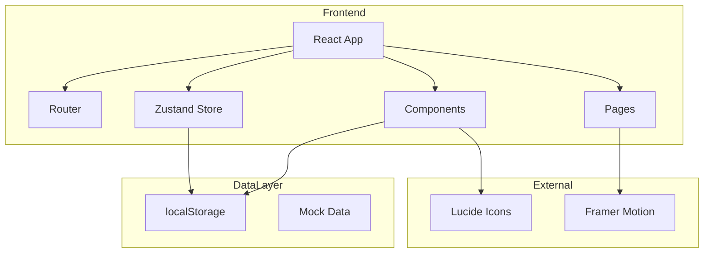

# LinguaFlow - 技术架构文档

## 1. 架构设计



## 2. 技术栈

### 2.1 核心框架
- **React 18** - 用户界面库
- **TypeScript** - 类型安全
- **Vite** - 构建工具

### 2.2 样式方案
- **TailwindCSS** - 原子化CSS框架
- 自定义CSS变量管理主题

### 2.3 状态管理
- **Zustand** - 轻量级状态管理
- **localStorage** - 持久化存储

### 2.4 路由与导航
- **React Router v6** - SPA路由

### 2.5 动画与交互
- **Framer Motion** - React动画库
- **CSS Animations** - 基础动效

### 2.6 图标与资源
- **Lucide React** - 图标库
- **Google Fonts** - 字体资源

## 3. 目录结构

```
/workspace
├── index.html
├── package.json
├── vite.config.ts
├── tailwind.config.js
├── tsconfig.json
├── postcss.config.js
├── src/
│   ├── main.tsx
│   ├── App.tsx
│   ├── index.css
│   ├── components/
│   │   ├── common/
│   │   │   ├── Button.tsx
│   │   │   ├── Card.tsx
│   │   │   ├── Modal.tsx
│   │   │   └── ProgressRing.tsx
│   │   ├── layout/
│   │   │   ├── Header.tsx
│   │   │   ├── Sidebar.tsx
│   │   │   └── Footer.tsx
│   │   ├── language/
│   │   │   ├── LanguageCard.tsx
│   │   │   └── LanguageBadge.tsx
│   │   ├── learning/
│   │   │   ├── FlashCard.tsx
│   │   │   ├── LessonCard.tsx
│   │   │   ├── SpeakingExercise.tsx
│   │   │   ├── ListeningExercise.tsx
│   │   │   └── GrammarExercise.tsx
│   │   ├── progress/
│   │   │   ├── ProgressDashboard.tsx
│   │   │   ├── StreakCalendar.tsx
│   │   │   └── AbilityChart.tsx
│   │   ├── achievement/
│   │   │   ├── AchievementBadge.tsx
│   │   │   └── AchievementToast.tsx
│   │   └── community/
│   │       ├── PostCard.tsx
│   │       └── CommentSection.tsx
│   ├── pages/
│   │   ├── Home.tsx
│   │   ├── Login.tsx
│   │   ├── Register.tsx
│   │   ├── Learn.tsx
│   │   ├── Lesson.tsx
│   │   ├── Progress.tsx
│   │   ├── Profile.tsx
│   │   └── Community.tsx
│   ├── store/
│   │   ├── userStore.ts
│   │   ├── progressStore.ts
│   │   └── courseStore.ts
│   ├── data/
│   │   ├── courses.ts
│   │   ├── vocabulary.ts
│   │   └── achievements.ts
│   ├── hooks/
│   │   ├── useLocalStorage.ts
│   │   └── useAudio.ts
│   ├── types/
│   │   └── index.ts
│   └── utils/
│       ├── storage.ts
│       └── helpers.ts
└── public/
    └── assets/
```

## 4. 路由定义

| 路由 | 页面组件 | 功能描述 |
|------|----------|----------|
| `/` | Home | 首页，语言选择，概览数据 |
| `/login` | Login | 用户登录 |
| `/register` | Register | 用户注册 |
| `/learn/:language` | Learn | 学习中心，课程列表 |
| `/learn/:language/:lessonId` | Lesson | 具体课程学习 |
| `/progress` | Progress | 学习进度追踪 |
| `/profile` | Profile | 个人中心，成就墙 |
| `/community` | Community | 社区讨论 |

## 5. 状态管理

### 5.1 用户状态 (userStore)

```typescript
interface UserState {
  user: User | null;
  isAuthenticated: boolean;
  login: (email: string, password: string) => Promise<boolean>;
  register: (name: string, email: string, password: string) => Promise<boolean>;
  logout: () => void;
  updateProfile: (data: Partial<User>) => void;
}
```

### 5.2 进度状态 (progressStore)

```typescript
interface ProgressState {
  progress: Record<Language, LanguageProgress>;
  updateXP: (language: Language, amount: number) => void;
  completeLesson: (language: Language, lessonId: string) => void;
  updateStreak: () => void;
  getOverallProgress: () => number;
}
```

### 5.3 课程状态 (courseStore)

```typescript
interface CourseState {
  courses: Course[];
  currentLesson: Lesson | null;
  setCurrentLesson: (lesson: Lesson) => void;
  getLessonsByLanguage: (language: Language) => Lesson[];
}
```

## 6. 数据模型

### 6.1 用户模型

```typescript
interface User {
  id: string;
  name: string;
  email: string;
  avatar: string;
  vip: boolean;
  joinDate: number;
  preferredLanguage: Language;
}
```

### 6.2 课程模型

```typescript
interface Course {
  id: string;
  language: Language;
  level: 'beginner' | 'intermediate' | 'advanced';
  title: string;
  description: string;
  icon: string;
  color: string;
  lessons: Lesson[];
  totalXP: number;
}

interface Lesson {
  id: string;
  title: string;
  type: 'vocabulary' | 'grammar' | 'speaking' | 'listening';
  duration: number;
  xpReward: number;
  content: VocabularyContent | GrammarContent | SpeakingContent | ListeningContent;
}
```

### 6.3 成就模型

```typescript
interface Achievement {
  id: string;
  title: string;
  description: string;
  icon: string;
  unlockedAt?: number;
  requirement: {
    type: 'streak' | 'lessons' | 'xp' | 'vocabulary';
    value: number;
  };
}
```

## 7. 组件清单

### 7.1 通用组件

| 组件 | 描述 | Props |
|------|------|-------|
| Button | 多功能按钮 | variant, size, loading, disabled |
| Card | 卡片容器 | hover, padding, gradient |
| Modal | 弹窗 | open, onClose, children |
| ProgressRing | 环形进度 | percent, size, color |

### 7.2 语言组件

| 组件 | 描述 |
|------|------|
| LanguageCard | 语言选择大卡片，含图标、学习人数、进度 |
| LanguageBadge | 紧凑型语言标签 |

### 7.3 学习组件

| 组件 | 描述 |
|------|------|
| FlashCard | 翻转闪卡，记忆单词 |
| LessonCard | 课程卡片，含进度、难度标签 |
| SpeakingExercise | 口语跟读练习，含评分 |
| ListeningExercise | 听力训练，含音频播放 |
| GrammarExercise | 语法选择题组件 |

### 7.4 进度组件

| 组件 | 描述 |
|------|------|
| ProgressDashboard | 进度仪表盘主视图 |
| StreakCalendar | 学习连续日历 |
| AbilityChart | 能力雷达图 |

### 7.5 社区组件

| 组件 | 描述 |
|------|------|
| PostCard | 帖子卡片 |
| CommentSection | 评论区域 |

## 8. 本地存储策略

### 8.1 存储键名

```typescript
const STORAGE_KEYS = {
  USER: 'linguaflow_user',
  PROGRESS: 'linguaflow_progress',
  ACHIEVEMENTS: 'linguaflow_achievements',
  SETTINGS: 'linguaflow_settings',
  SESSIONS: 'linguaflow_sessions'
};
```

### 8.2 初始化数据

首次加载时，若无本地数据，自动初始化：
- 默认用户会话
- 各语言零进度
- 未解锁成就
- 默认设置

## 9. 性能优化

- 路由懒加载 (React.lazy)
- 组件按需渲染
- 图片资源优化
- 动画 GPU 加速 (transform, opacity)
- 状态批量更新

## 10. 可访问性

- 语义化 HTML
- ARIA 标签
- 键盘导航
- 焦点管理
- 颜色对比度合规
