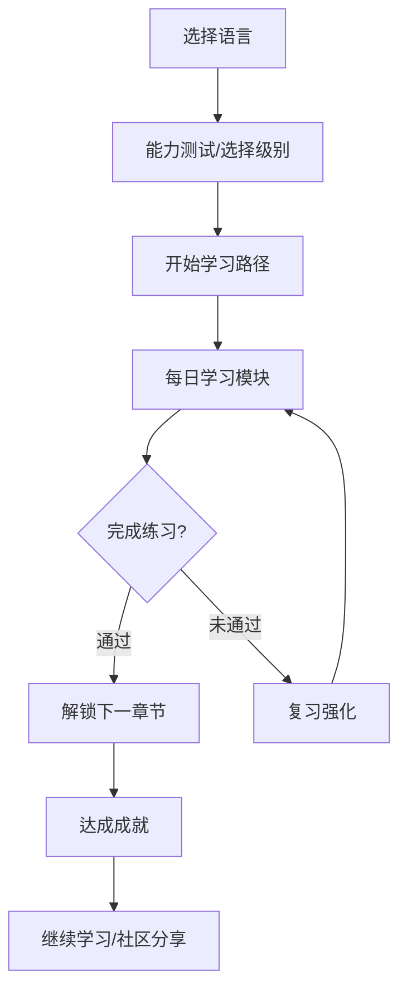
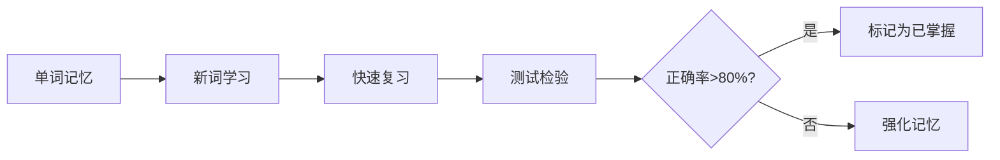

# LinguaFlow - 多语种在线学习平台

## 1. 产品概述

LinguaFlow 是一款沉浸式多语种在线教育平台，致力于为学习者提供专业、有趣的语言学习体验。平台支持英语、日语、韩语等主流语言，通过智能分级课程、互动学习模块和成就激励系统，帮助用户在游戏化的环境中高效掌握新语言。

**目标用户**：语言学习初学者至中高级学习者，年龄范围 16-45 岁

**核心价值**：将语言学习转化为沉浸式体验，让用户在学习中获得成就感和社交互动乐趣

---

## 2. 核心功能模块

### 2.1 用户角色

| 角色 | 注册方式 | 核心权限 |
|------|----------|----------|
| 游客 | 无需注册 | 浏览平台、体验免费课程 |
| 注册用户 | 邮箱/手机注册 | 完整学习功能、学习进度追踪、社区互动 |
| VIP用户 | 付费升级 | 解锁高级课程、AI智能辅导、专属学习路径 |

### 2.2 功能架构

1. **首页**：语言选择、学习入口、学习数据概览
2. **学习中心**：分级课程、互动学习模块、进度追踪
3. **个人中心**：学习报告、成就墙、学习路径推荐
4. **社区**：学习小组、话题讨论、用户动态
5. **认证系统**：用户注册、登录、会话管理

---

## 3. 页面详情

### 3.1 首页 (Home)

| 模块名称 | 功能描述 |
|----------|----------|
| 语言选择区 | 英语/日语/韩语三大语言卡片，带学习人数统计 |
| Hero区域 | 动态标语、学习路径入口、学习数据展示 |
| 推荐课程 | 根据用户兴趣推荐的热门课程轮播 |
| 学习成就 | 用户累计学习天数、掌握词汇数等 |
| 社区动态 | 显示近期学习社区热门话题 |

### 3.2 学习中心 (Learning)

| 模块名称 | 功能描述 |
|----------|----------|
| 课程列表 | 展示各语言各级别课程，支持难度筛选 |
| 单词记忆 | 闪卡记忆、间隔重复、测试模式 |
| 语法练习 | 填空题、选择题、语法解析 |
| 口语跟读 | 语音识别、跟读评分、对比波形展示 |
| 听力训练 | 听写练习、对话听力、分级听力量表 |

### 3.3 学习进度 (Progress)

| 模块名称 | 功能描述 |
|----------|----------|
| 进度仪表盘 | 环形进度图显示整体学习进度 |
| 每日目标 | 今日学习计划、完成打卡 |
| 学习日历 | 日历视图标记学习记录 |
| 能力雷达图 | 展示听说读写各维度能力 |

### 3.4 个人中心 (Profile)

| 模块名称 | 功能描述 |
|----------|----------|
| 用户信息 | 头像、昵称、学习天数、VIP状态 |
| 成就墙 | 徽章展示、学习里程碑 |
| 学习路径 | 个性化推荐课程路线图 |
| 设置 | 账号设置、通知设置、学习偏好 |

### 3.5 社区 (Community)

| 模块名称 | 功能描述 |
|----------|----------|
| 话题广场 | 按语言/话题分类的讨论帖 |
| 学习小组 | 同语言学习者组成的小组 |
| 问答区 | 学习问题互助解答 |
| 热门动态 | 用户学习打卡、成就分享 |

---

## 4. 核心流程

### 4.1 用户学习流程



### 4.2 学习模块交互流程



---

## 5. UI设计规范

### 5.1 设计风格

**主题方向**：现代极简 + 活力渐变

**色彩系统**：
- 主色：#6366F1 (靛蓝紫 - 智慧与信任)
- 次要色：#8B5CF6 (紫罗兰 - 创造力与成长)
- 强调色：#F59E0B (琥珀金 - 成就与激励)
- 背景色：#0F172A (深夜蓝) / #F8FAFC (晨曦白)
- 文字色：#F1F5F9 (主文字) / #94A3B8 (次要文字)

**字体选择**：
- 标题：Noto Sans SC (中文)、Noto Sans JP (日语)、Noto Sans KR (韩语)
- 正文：Inter (英文)、系统字体回退

**布局风格**：
- 卡片式布局，柔和圆角 (12-16px)
- 毛玻璃效果背景
- 微妙的渐变和阴影层次

**图标风格**：
- 使用 Lucide 图标库
- 双色渐变填充图标

### 5.2 交互动效

- 页面切换：淡入淡出 + 轻微上移 (300ms ease-out)
- 卡片悬停：微缩放 1.02 + 阴影增强
- 按钮点击：轻微下沉 + 颜色加深
- 进度更新：数字滚动 + 环形填充动画
- 成就解锁：爆发动画 + 粒子效果

### 5.3 响应式策略

- 桌面优先设计 (1440px 基准)
- 平板适配 (768px 断点)
- 移动端适配 (375px 最小宽度)
- 触摸设备优化：增大点击区域

---

## 6. 数据存储

### 6.1 本地存储结构

使用 localStorage 存储用户数据：

```javascript
{
  user: {
    id: string,
    name: string,
    email: string,
    avatar: string,
    vip: boolean,
    joinDate: timestamp
  },
  progress: {
    [language]: {
      level: number,
      xp: number,
      streak: number,
      vocabulary: string[],
      completedLessons: string[],
      dailyGoal: { target: number, completed: number }
    }
  },
  achievements: string[],
  settings: {
    dailyReminder: boolean,
    theme: 'dark' | 'light'
  }
}
```

### 6.2 课程数据结构

```javascript
{
  courses: [
    {
      id: string,
      language: 'en' | 'jp' | 'kr',
      level: 'beginner' | 'intermediate' | 'advanced',
      title: string,
      description: string,
      lessons: [
        {
          id: string,
          title: string,
          type: 'vocabulary' | 'grammar' | 'speaking' | 'listening',
          content: object,
          xpReward: number
        }
      ]
    }
  ]
}
```

---

## 7. 技术实现要点

### 7.1 前端框架

- React 18 + TypeScript
- Vite 构建工具
- TailwindCSS 样式方案
- React Router 路由管理
- Zustand 状态管理
- Framer Motion 动画库

### 7.2 核心组件

- LanguageCard: 语言选择卡片
- CourseCard: 课程展示卡片
- LessonModule: 学习模块容器
- FlashCard: 单词闪卡组件
- AudioPlayer: 音频播放组件
- ProgressRing: 进度环形图
- AchievementBadge: 成就徽章
- Leaderboard: 排行榜组件

### 7.3 页面路由

| 路由 | 页面 |
|------|------|
| / | 首页 |
| /learn/:language | 学习中心 |
| /learn/:language/:lessonId | 具体课程 |
| /progress | 学习进度 |
| /profile | 个人中心 |
| /community | 社区 |
| /login | 登录页 |
| /register | 注册页 |
